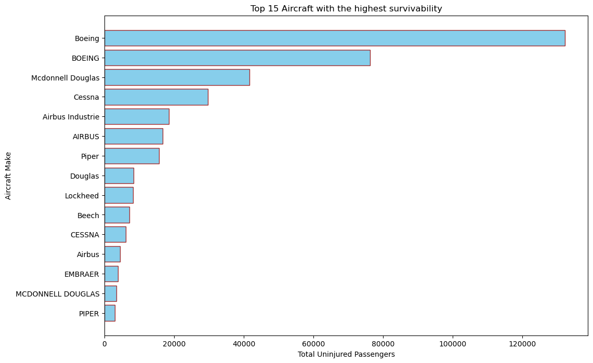
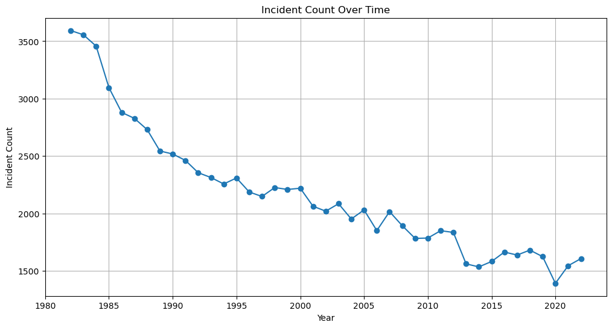
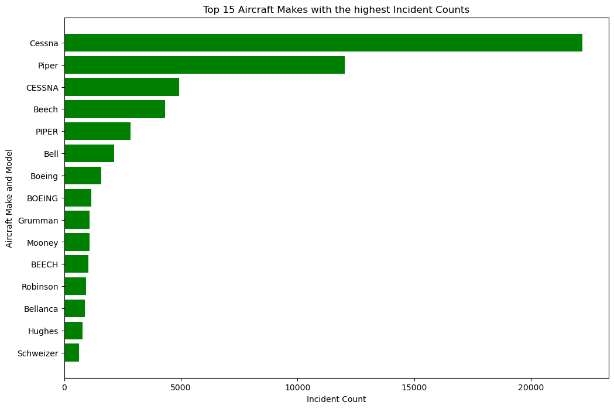

# Analysis of Aircraft Incident Frequencies by Make and Model: Identifying Low-Risk Aircraft for Commercial and Private Operations

## Business Understanding

Our company is poised to enter the aviation industry by purchasing and managing aircraft for both private and commercial usage, with the goal of expanding its portfolio. Given the inherent dangers associated with aviation, it is imperative to comprehend these risks in order to make well-informed judgments. In order to ensure a safe and successful launch into the market, this project aims to deliver a data-driven examination of aviation safety with a particular focus on finding the lowest-risk aircraft.

This project analyzes Aviation Data collected between 1962 and 2023 to come up with useful insights to guide the company towards finding the lowest risk aircrafts for a new endeavor.

## Data Understanding and Analysis

The data used in this project is a dataset from the National Transportation Safety Board that includes aviation accident data from 1962 to 2023 about civil aviation accidents and selected incidents in the United States and international waters.

The dataset contains 31 attributes and 90348 records.

For the purpose of this analysis, the data was filtered to remain with the attributes and records that were relevant. The cleaned and filtered dataset used has 11 attributes and 88889 records.

In order to establish which aircrafts are the lowest risk for the company to begin this endeavor, several analysis were carried out including:

- Analysis of Injury Severity by Aircraft Make and Model
- Survivability Analysis by Aircraft Make
- Incident Frequency by Aircraft Make
- Time Trend Analysis of Incidents
- Injury Severity by Broad Phase of Flight
- Analysis of risks associated with Purpose of Flight

## Findings

The analysis yielded meaningful insights as can be seen from the following visualizations:

## Tableau Interactive Dashboard

(https://public.tableau.com/views/AviationAccidents_17178781861510/AviationAccidentsDashboard?:language=en-US&publish=yes&:sid=&:display_count=n&:origin=viz_share_link)

## Presentation

(https://www.canva.com/design/DAE1o1ooHOo/u3C8FTXHWrvEYxbgcCz8DA/edit?utm_content=DAE1o1ooHOo&utm_campaign=designshare&utm_medium=link2&utm_source=sharebutton)

## Conclusion

From the analysis conducted on the aviation data, the observations were made:

1. Cessna and Piper aircraft makes are associated with the highest injury and icident rates
2. Boeing aircraft have higher survivability rates and are not listed among the top 10 high-risk aircraft makes.
3. The trend analysis shows a gradual decline in airplane incidents over the years, reflecting improvements in aviation technology, safety protocols, and regulatory oversight.
4. Most injuries occur during Cruise and Take-Off phases, indicating critical points where enhanced safety measures are necessary.
5. Personal and Instructional Flight categories have the highest total injuries, indicating they are the most risky.